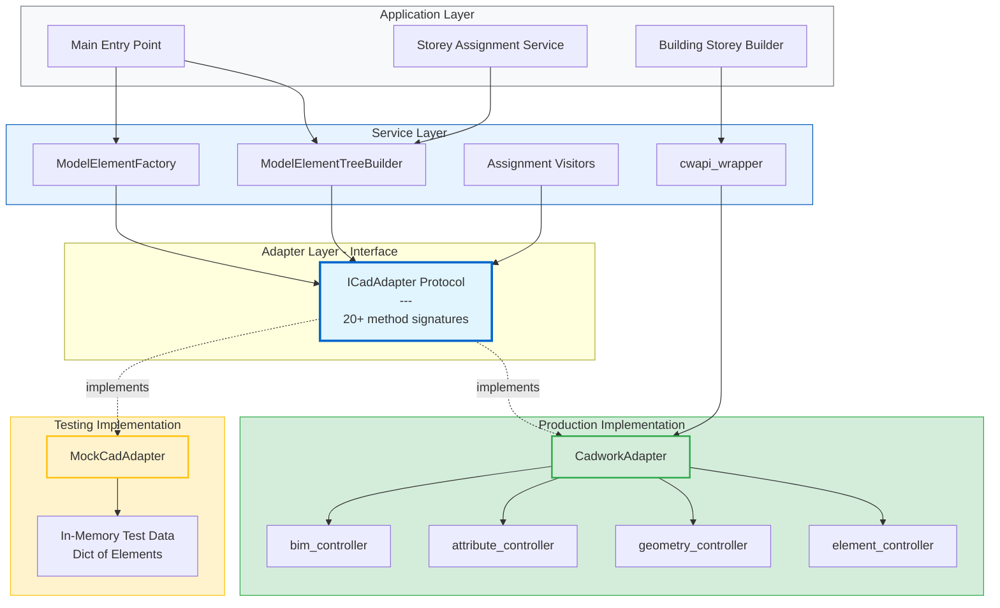
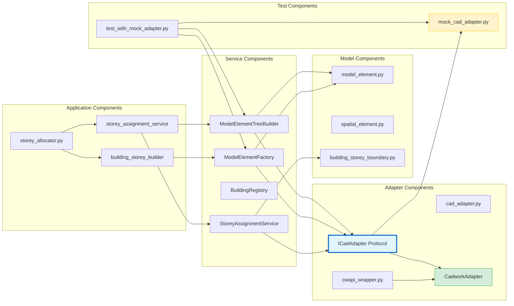
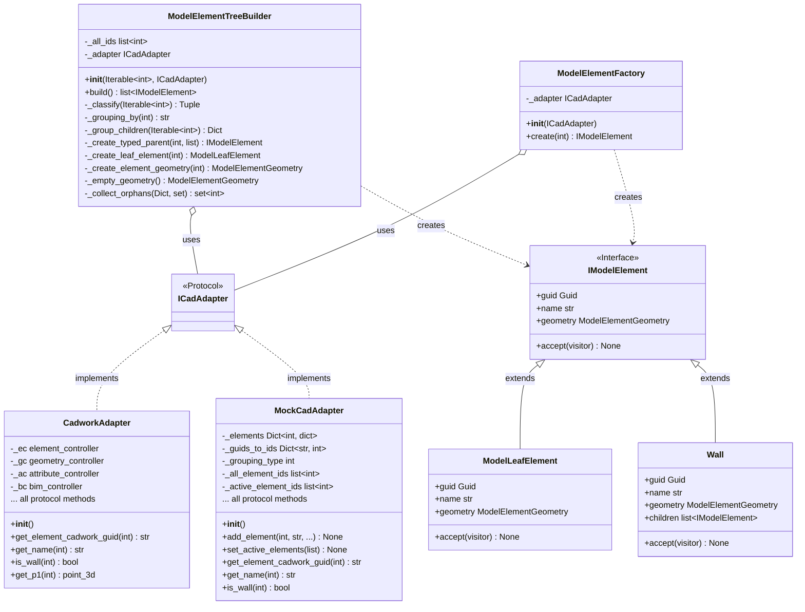
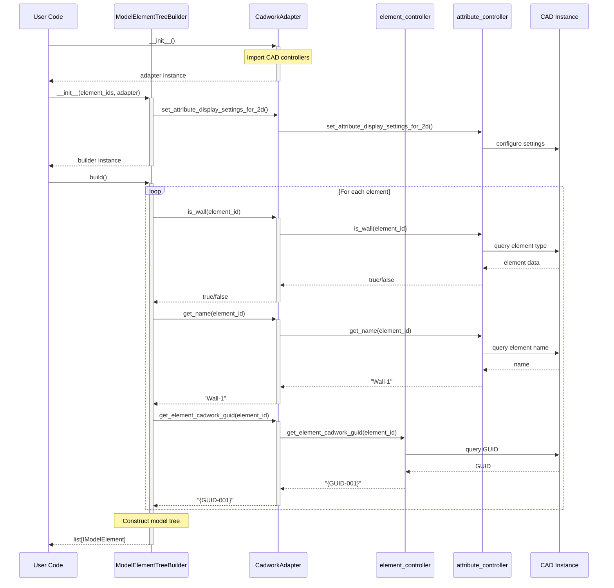
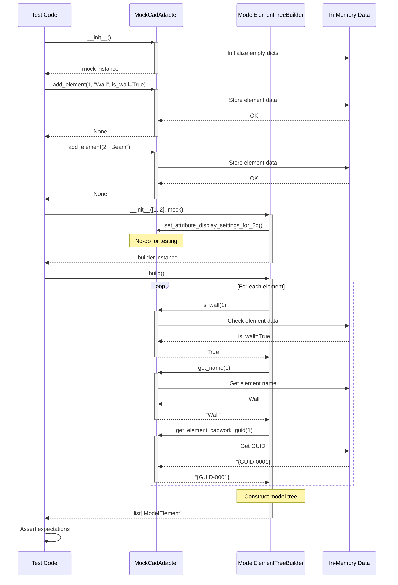
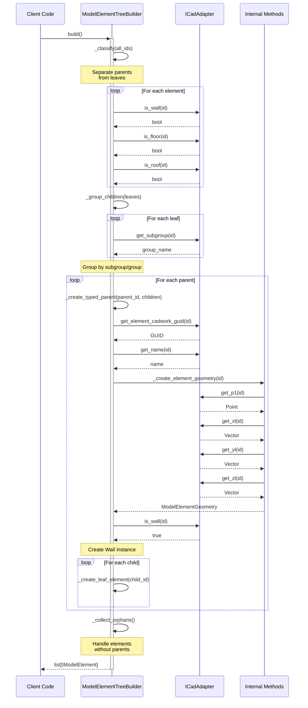
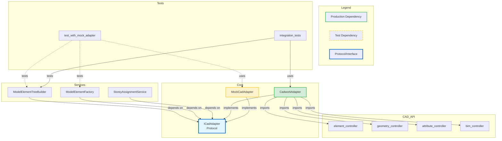
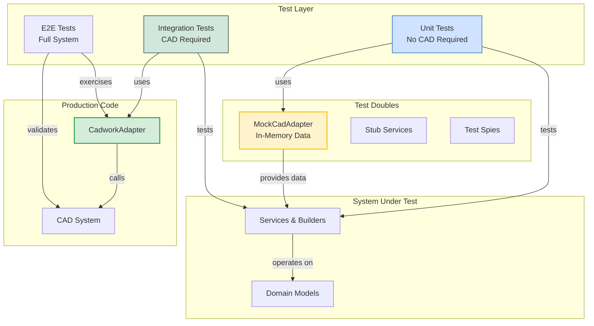

# Architecture Diagrams

This document contains architectural diagrams for the CAD Adapter Pattern implementation using Mermaid syntax.

## Table of Contents

- [High-Level Architecture](#high-level-architecture)
- [Component Diagram](#component-diagram)
- [Class Diagram](#class-diagram)
- [Sequence Diagrams](#sequence-diagrams)
    - [Production Flow](#production-flow)
    - [Test Flow](#test-flow)
    - [Tree Building Flow](#tree-building-flow)
- [Dependency Graph](#dependency-graph)
- [Testing Architecture](#testing-architecture)
- [Data Flow Diagram](#data-flow-diagram)

---

## High-Level Architecture

---

## Component Diagram

---

## Class Diagram

---

## Sequence Diagrams

### Production Flow

### Test Flow

### Tree Building Flow

---

## Dependency Graph

---

## Testing Architecture

---

## Data Flow Diagram

```mermaid
graph LR
    subgraph Input["Data Input"]
        User[User Selection]
        CADData[CAD Database]
    end

    subgraph Processing["Data Processing"]
        GetIDs[Get Element IDs]
        Adapter[ICadAdapter]
        Extract[Extract Attributes]
        Classify[Classify Elements]
        Group[Group by Hierarchy]
        Build[Build Tree Structure]
    end

    subgraph Output["Data Output"]
        Tree[Model Element Tree]
        Assignment[Storey Assignment]
        Report[Assignment Report]
    end

    User -->|Selects Elements| GetIDs
    GetIDs -->|Element IDs| Adapter
    Adapter -->|Query| CADData
    CADData -->|Element Data| Adapter
    Adapter -->|Attributes| Extract
    Extract -->|Name, Type, GUID| Classify
    Classify -->|Parents & Leaves| Group
    Group -->|Grouped Elements| Build
    Build -->|Hierarchical Structure| Tree
    Tree -->|Input for| Assignment
    Assignment -->|Results| Report
    style Adapter fill: #e1f5ff, stroke: #0066cc, stroke-width: 2px
    style CADData fill: #f8d7da, stroke: #842029
    style Tree fill: #d1e7dd, stroke: #0a3622
```

